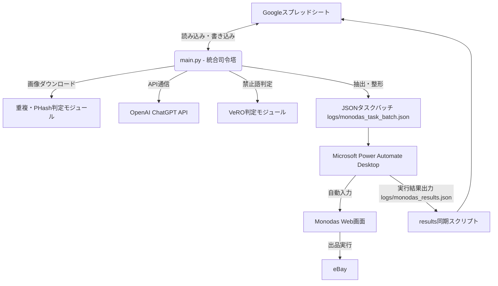

# AutoList - システム引き継ぎ資料（開発・保守者向け）

本ドキュメントは、AutoListシステムの全体構成、ソースコードの役割、および保守・改修手順を説明した開発者向けの引き継ぎ資料です。

---

## 1. システム全体構成図



---

## 2. フォルダ・ファイル構成一覧

```text
AutoList_PAD/
│
├── main.py                     # システム全体の実行制御（統合司令塔）
├── diagnose_system.py          # 環境と認証の自己診断ツール（新規追加）
├── setup_sheets.py             # スプレッドシート初期セットアップ
├── clear_sheets.py             # テストデータ消去・リセット用スクリプト
├── sync_results.py             # PADからの実行結果のシート同期スクリプト
├── requirements.txt            # Python依存ライブラリ一覧
│
├── config/                     # 設定ファイルディレクトリ
│   ├── api_keys.json           # APIキー、モデル設定、スプレッドシートID
│   ├── sheet_config.json       # シート名、列マッピング、自動化ルール
│   ├── selectors_config.json   # Monodas用CSSセレクタとブラウザ設定
│   ├── genre_templates.json    # ジャンル別プロンプト・出力定義（新規追加）
│   └── vero_keywords.json      # VeRO禁止キーワード辞書（ローカル用）
│
├── credentials/                # 認証情報ディレクトリ
│   └── service-account.json    # Google Sheets API用サービスアカウントキー
│
├── modules/                    # 機能モジュール
│   ├── chatgpt.py              # OpenAI API連携（ジャンル別プロンプト生成）
│   ├── duplicate_checker.py    # 重複判定（JAN、型番、URL、画像PHash）
│   ├── error_handler.py        # エラーロギング・通知管理
│   ├── gsheets.py              # Google Sheets APIの軽量ラッパー
│   ├── shipping.py             # シッピングポリシー自動選択ロジック
│   ├── validator.py            # 入力形式・必須値の検証
│   └── vero_checker.py         # 禁止語検知・自動置換
│
└── docs/                       # ドキュメントディレクトリ
    ├── manual.md               # 運用・トラブル対応マニュアル
    └── handover.md             # 本引き継ぎ資料
```

---

## 3. Pythonプログラム一覧と役割説明

### 3-1. 実行スクリプト
- `main.py`: スプレッドシートからデータを取得し、AI出品情報生成、エラー・重複・VeROバリデーションを行い、Monodas用のJSONバッチを作成します。
- `diagnose_system.py`: 依存パッケージ、設定ファイル、APIキー、Google接続、OpenAI接続の全ステータスを一括テストする自己診断ツールです。
- `setup_sheets.py`: スプレッドシートに必要なタブ（出品管理表、重複チェックDB、禁止用語辞書など）と初期ヘッダーを自動生成します。

### 3-2. 内部モジュール（`modules/`）
- `chatgpt.py`: カテゴリ名から自動的にジャンルを判別し、`config/genre_templates.json`から各ジャンル専用のプロンプトとItem Specificsを動的ロードします。
- `duplicate_checker.py`: JANコード、型番、URLの一致チェックに加え、`imagehash`を用いた画像PHash（類似画像検知）による重複排除を行います。
- `gsheets.py`: Google Sheets APIを`urllib`ベースで直接操作する軽量クライアントです。

---

## 4. 使用ライブラリ一覧 (Python 3.10+)

依存ライブラリは、システムの軽量化のため必要最小限（urllibによる直接通信）に抑えられています。

*   `Pillow` (PIL): 画像のダウンロードと読み込み
*   `imagehash`: 画像のPerceptual Hashing (PHash)の算出
*   `requests`: 画像データのダウンロード通信用

インストール方法：
```bash
pip install -r requirements.txt
```

---

## 5. 設定ファイル・環境変数一覧

### 5-1. 設定ファイル
- `config/api_keys.json`:
  - `openai.api_key`: ChatGPT通信用キー
  - `google.spreadsheet_id`: ターゲットスプレッドシートID
  - `google.service_account_key_file`: サービスアカウントキーパス
- `config/genre_templates.json`: 各ジャンル（フィギュア、プラモデル、おもちゃ、ラジコン、ゲーム、カード）ごとのAI指示書、出力項目、およびMonodasカテゴリ複製用のeBay参照ID (`ebay_ref_id`) を定義。ジャンルの複製元eBay商品が変更になった場合はこのIDを変更します。
- `config/selectors_config.json`: MonodasやeBayのHTML要素のCSSセレクタ。画面変更時はこのファイルのセレクタを修正することで、PADのコードを変更することなく対応可能です。

### 5-2. 環境変数
- 基本的にすべてのキー情報は設定ファイルで管理されるため、特別な環境変数の設定は不要です。（OpenAI APIキーはフォールバックとして環境変数 `OPENAI_API_KEY` も利用可能です）。

---

## 6. Google Sheetsのシート（タブ）説明

1. **出品管理表**: 出品データ、AI生成結果、出品ステータスを管理するメインシート。
2. **重複チェックDB**: 過去の出品情報（SKU、タイトル、JAN、URL、画像PHashなど）を蓄積するデータベース。重複検知はこのシートを基準に行われます。
3. **禁止用語辞書**: VeROチェック用のキーワードリスト。
4. **シッピングポリシー一覧**: 価格や除外地域に応じた配送方法の自動判別用ポリシーマッピング。

---

## 7. 新規PCへの移行・環境構築手順

システムを別のPCへ移行する場合の最短手順です。

1. **Pythonのインストール**: Python 3.10以上を新規PCにインストールします。
2. **ソースコードの配置**: ソースコード一式を任意のフォルダに展開します。
3. **依存ライブラリのインストール**:
   ```bash
   pip install -r requirements.txt
   ```
4. **設定ファイルの準備**:
   - `config/api_keys.json` に正しいキーが書き込まれているか確認。
   - `credentials/service-account.json` を配置。
5. **自己診断の実行**:
   ```bash
   python diagnose_system.py
   ```
   エラーがないことを確認してください。

---

## 8. バックアップと復旧手順

- **バックアップ対象**:
  1. `config/` フォルダ（すべての設定とプロンプト）
  2. `credentials/` フォルダ（Google APIのキー）
  3. Googleスプレッドシートの履歴（Googleスプレッドシートの「ファイル」>「変更履歴」よりいつでも過去データに復旧可能です）
- **データ破損時の復旧方法**:
  - `diagnose_system.py`を実行してエラー個所を特定します。
  - 重複チェックDBが壊れた場合、空のシートを作成して `setup_sheets.py` を再実行すれば自動復元されます。
